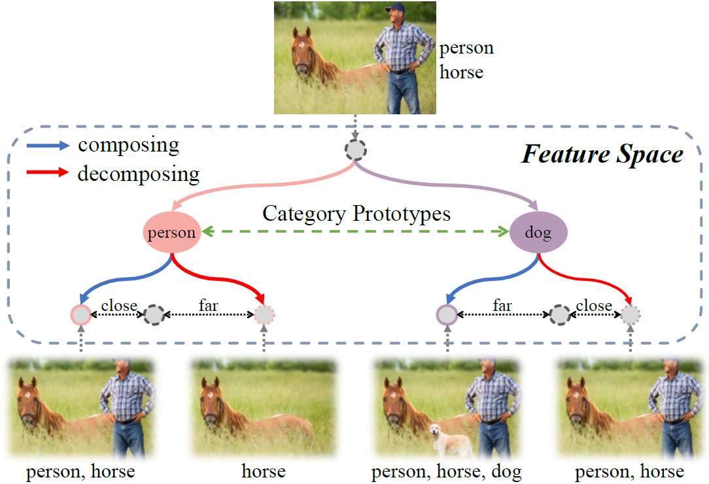
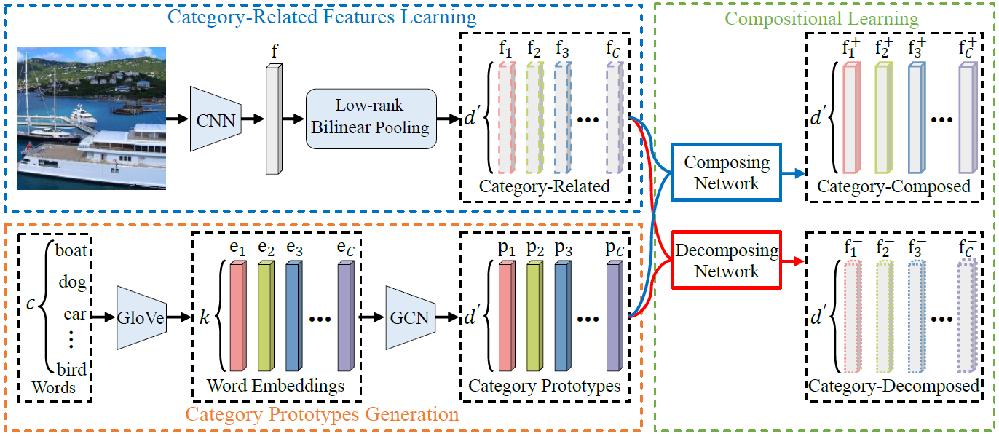

# Multi-label Image Classification via Category Prototype Compositional Learning

Code for paper "Multi-label Image Classification via Category Prototype Compositional Learning"

**Abstract:**  
  The real-world images are often composed of multiple objects with different categories, scales, poses and locations. Adding inexistent objects to an image (composing) or removing existing objects from an image (decomposing) leads to the high discrepancy in appearance, which reveals an important but long-neglected compositional nature of multi-label images. In light of this observation, we propose a novel end-to-end compositional learning framework named Category Prototype Compositional Learning (CPCL) to model such compositional nature for multi-label image classification. In CPCL, each image is represented by a collection of category-related features to eliminate the negative effects from location information. Then, a compositional learning module is introduced to compose and decompose the category-related features with their corresponding category prototypes, which are derived from the semantic representations of categories. If the image has the given object, the output after composing should be closer to the original input than the output after decomposing. Contrarily, if the image does not have the given object, the output after decomposing should be closer to the original input than the output after composing. We introduce the Transformed Appearance Distance (TAD) to measure the appearance change between the composed and decomposed features relative to the category-related features with respect to each category. Finally, the multi-label image classification is accomplished by performing a TAD-based metric learning. Experimental results on three multi-label image classification benchmarks, i.e., NUS-WIDE, MS-COCO and VOC 2007, validate the effectiveness and superiority of our work in comparison with the state-of-the-arts.





## Environment

Python 3.5.2

Pytorch 1.1.0

torchvision 0.2.2

## Demo NUS-WIDE

```sh
cd NUS-WIDE
bash run_nuswide.sh
```

## Demo MS-COCO

```sh
cd MS-COCO
bash run_coco.sh
```

## Demo VOC 2007

```sh
cd VOC
bash run_voc2007.sh
```
